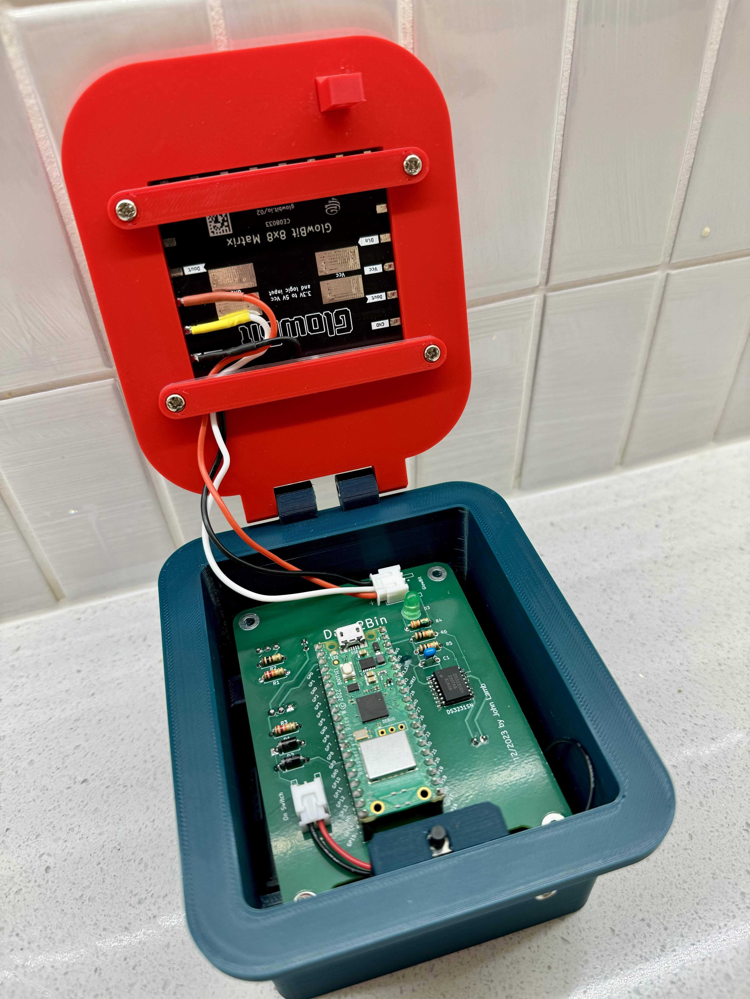
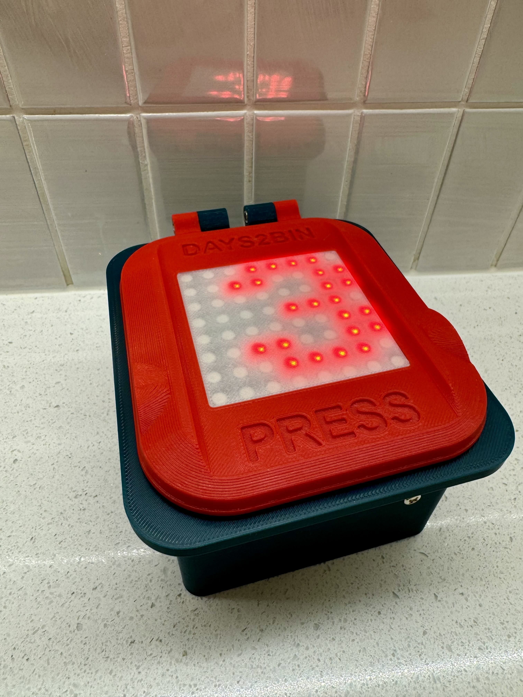
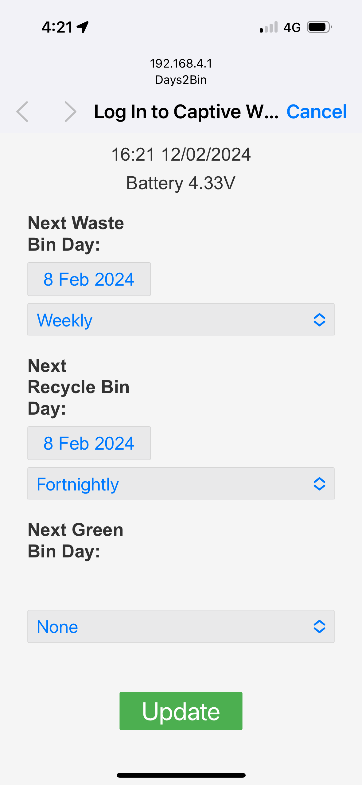

#Days2Bin

An indicator to show number of days until different kerbside
bins/trash/recycling etc are due to be collected.

Hardware - Raspberry Pi Pico W, DS3231 RTC and
Core Electronics GlowBit (based on WS2812 addressable LEDs).
 
The device is powered by 3 x AAA batteries switched by a pair of logic level MOSFETs
triggered by grounding via a momentary pushbutton, and kept alive
by one of the Pico W GPIO's.

A separate pair of AAA batteries powers the DS3231 RTC. These should last much longer than the main batteries due to the very low current drain of the DS3231, and having them saves having to re-enter the time.

The settings are stored in a dedicated page of flash, which is reserved by a custom loader script.

Settings are entered by holding the pushbutton down until a Wifi symbol is displayed, and joining the Days2Bin wifi access point. Apple devices should then display the settings page via captive portal. Other devices can display the page by browsing to http://192.168.4.1 after joining the access point.

Up to three bins can be configured: general waste, recyling, and green waste. The device scrolls the number of days to each type in red, yellow and green colours respectively, then powers off, unless the button is held on, in which case Settings mode is entered.

On first use, or if the clock battery has failed, users are prompted to join the access point.

Time out for the access point is 2 minutes.

This project was coded entirely in C using the Pico SDK. I originally tried to code it in MicroPython, however the startup time was several seconds, whereas the C version is virtually instant.

2024 by John Lamb
Licenced under MIT Licence